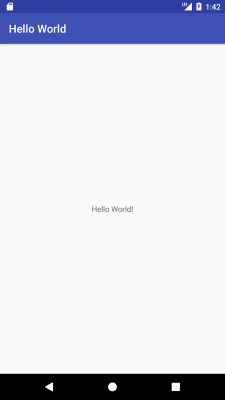
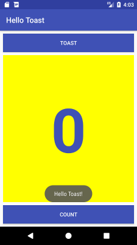
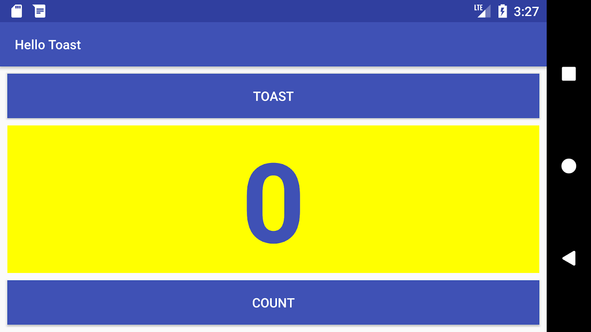
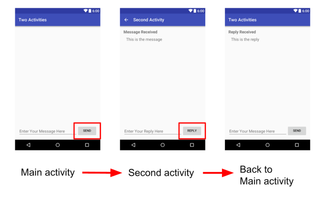
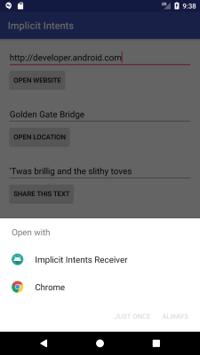
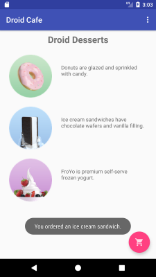
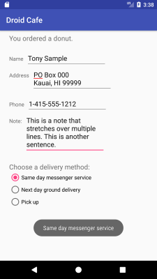
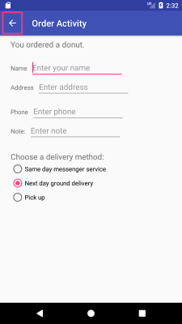
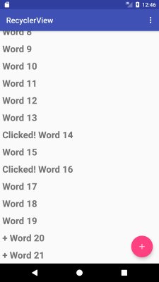
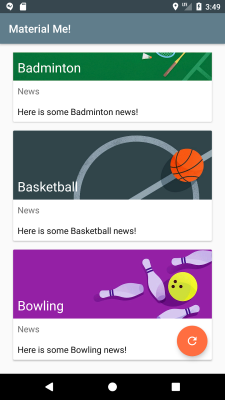

# Assignments

## Week 1. Kick off
<strong>1. GitHub your project</strong>: Github is a code hosting platform for version control and collaboration.
- Create your own [GitHub](https://github.com/) account by following the [guide](https://guides.github.com/activities/hello-world/).
- Fill in the [form](https://docs.qq.com/sheet/DRmxJek93RFdTSHNX) with your wechat and GitHub Url.
- Manage your project using [GitHub Desktop](https://desktop.github.com/)

<strong>2. Write your *.md</strong>: [Markdown](https://www.markdownguide.org/) is a lightweight markup language that you can use to add formatting elements to plaintext text documents. 
- Learn from the [Basic Syntax](https://www.markdownguide.org/basic-syntax/) and [Cheat Sheet](https://www.markdownguide.org/cheat-sheet/)
- Write your own <strong>README.md in your github</strong> which includes your app plan and design.
- Add a new file named <strong>practices.md in your github</strong> which includes the screenshots and descriptions</strong> for your codelabs.

## Week 2. Get started
- [Codelab 1.1: Android Studio and Hello World](https://codelabs.developers.google.com/codelabs/android-training-hello-world/#0)

## Week 3. Layouts and resources for the UI
- [Codelab 1.2 Part A: Your first interactive UI](https://codelabs.developers.google.com/codelabs/android-training-layout-editor-part-a/)

- [Codelab 1.2 Part B: The layout editor](https://codelabs.developers.google.com/codelabs/android-training-layout-editor-part-b/)

## Week 4. Activities and intents
- [Codelab 2.1: Activities and intents](https://codelabs.developers.google.com/codelabs/android-training-create-an-activity/index.html)

## Week 5. Implicit Intents
- [Codelab 2.3: Implicit Intents](https://codelabs.developers.google.com/codelabs/android-training-activity-with-implicit-intent/)

## Week 6. User Interaction
- [Codelab 4.1: Clickable images](https://codelabs.developers.google.com/codelabs/android-training-clickable-images)

- [Codelab 4.2: Input controls](https://codelabs.developers.google.com/codelabs/android-training-input-controls)

## Week 7. User Interaction
- [Codelab 4.4: User navigation](https://codelabs.developers.google.com/codelabs/android-training-provide-user-navigation)

- [Codelab 4.5: RecyclerView](https://codelabs.developers.google.com/codelabs/android-training-create-recycler-view)

## Week 8. Material Design
- [Codelab 5.2: Cards and colors](https://codelabs.developers.google.com/codelabs/android-training-cards-and-colors)

## Week 9. Background Tasks
- [Codelab 7.2: AsyncTask and AsyncTaskLoader](https://developer.android.com/codelabs/android-training-asynctask-asynctaskloader)

